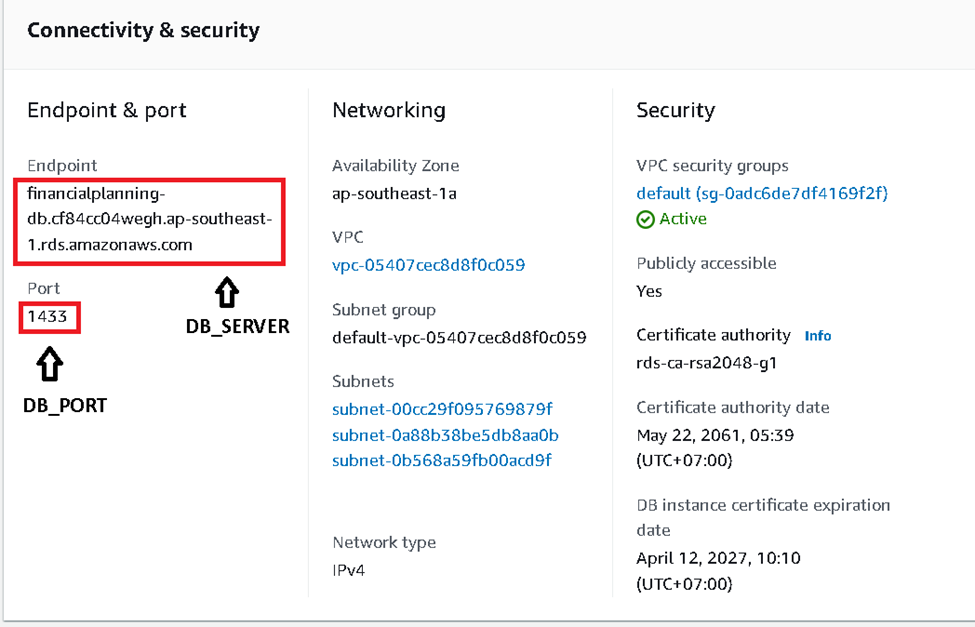
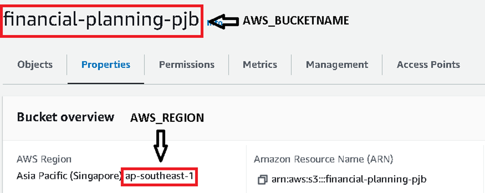

# Financial Planning System Deployment Guide

This guide outlines the steps required to deploy the Financial Planning system in your environment. Please follow the instructions carefully to ensure a successful deployment.

## 1. Database Preparation:

- The database uses AWS RDS.
- Log into the AWS Management Console.
- Choose service RDS.
- Create a database with the following configuration:
  - Engine Options: Microsoft SQL Server
  - Engine Version: SQL Server 2022 XXX
  - Master Username: Database’s username
  - Credentials Management: Self-managed
  - Master Password: Database’s password
  - Public Access: Yes

## 2. File System Preparation:

- The database uses AWS S3.
- Log into the AWS Management Console.
- Choose S3.
- Create a bucket.
- Choose IAM.
- Create a user with the following configuration:
  - Permissions Options: Attach policies directly.
  - Permissions Policies: AmazonS3FullAccess.
- After creating the user, create an access key in the user details with the following configuration:
  - Use Case: Local code.
- Save the access key and secret key. Note: The secret key cannot be obtained after this step unless a new user is created.

## 3. API Service and Portal Setting:

### Database Configuration:

- Click on the database on RDS to see database details.
- Change environment variables in docker-compose.yml:
  - `DB_SERVER`: See picture 1.
  - `DB_PORT`: See picture 1.
  - `DB_NAME`: Database’s name (Default: FinancialPlanning).
  - `DB_USER`: Database’s username.
  - `DB_PASSWORD`: Database’s password.
  - `SYSADMIN_EMAIL`: Admin’s email address.
  - `SYSADMIN_PASSWORD`: Admin’s password.

### File System Configuration:

- Click on the bucket on S3 to see bucket details.
- Change environment variables in docker-compose.yml:
  - `AWS_ACCESSKEY`: User’s access key.
  - `AWS_SECRETKEY`: User’s secret key.
  - `AWS_REGION`: See picture 2.
  - `AWS_BUCKETNAME`: See picture 2.

### Notification Email Setting:

- Open appsettings.json file and change variables:
  - `EmailSetting/Email`: Self-chosen email address.
  - `EmailSetting/Password`: Email’s app password.

## System Deployment:

- Open a terminal in the project folder.
- Execute "`docker compose up -d`" to deploy containers.

## Support:

For any assistance or queries, please contact nguyenducthinhch2@gmail.com.

## Disclaimer:

Ensure all configurations and credentials are handled securely. Make sure to follow best practices for deployment and system management to maintain security and stability.
